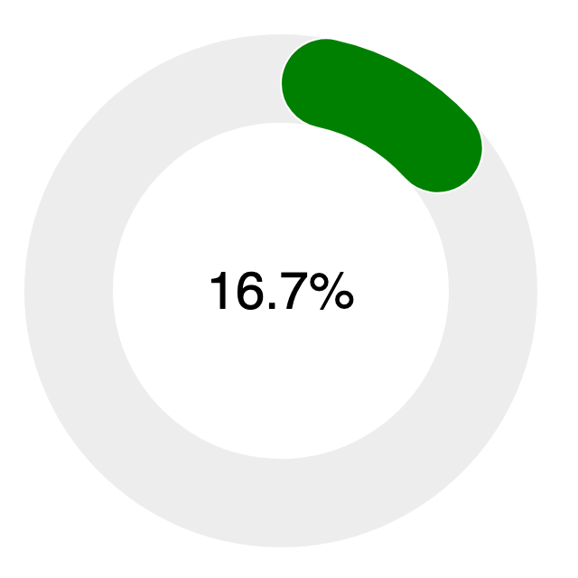
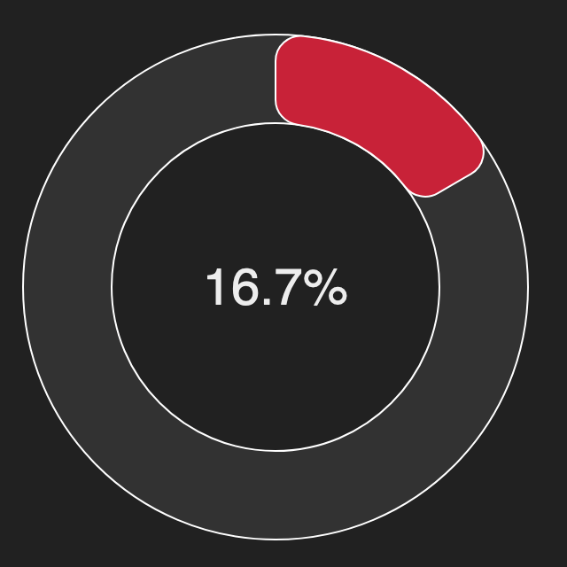

# Energise Ōtaki: Donut Chart

This project is a small web app to render of an instantaneous meter reading datum stream from SolarNetwork as a "donut" style gauge chart.

You can see the chart in action here:

<https://go.solarnetwork.net/nz/eo/donut/>



# URL parameters

Various aspects of the chart can be customised via URL query parameters.

> :warning: Remember that the values must be URL escaped. For example a `color` parameter of
> `#FF0000` would be encoded in the URL as `color=%23FF0000`.

| Parameter          | Default               | Description                                                                                                                                      |
| :----------------- | :-------------------- | :----------------------------------------------------------------------------------------------------------------------------------------------- |
| `nodeId`           | 690                   | The SolarNetwork node ID of the datum stream to display.                                                                                         |
| `sourceId`         | `EO/OC/ROOF1/SOLAR/1` | The SolarNetwork source ID of the datum stream to display.                                                                                       |
| `propName`         | `watts`               | The datum stream property name to display.                                                                                                       |
| `displayName`      | Power (kW)            | The property display name, shown in the tooltip when hovering over the active portion of the chart.                                              |
| `scale`            | 1000                  | A value to divide raw property values by, to convert to the desired display scale. For example the default scale `1000` converts W values to kW. |
| `minValue`         | 0                     | The minimum overall value, expressed in display scale units.                                                                                     |
| `maxValue`         | 10                    | The maximum overall value, expressed in display scale units.                                                                                     |
| `barWidth`         | 50                    | The width of the donut, in pixels.                                                                                                               |
| `width`            | 300                   | The overall width of the chart, in pixels.                                                                                                       |
| `cornerRadius`     | 0                     | If greater than `0`, a bar width ratio to round the bar endcap corners by. For example `0.5` would result in a semi-circle endcap appearance.    |
| `color`            | `#008000`             | The bar color, as a CSS color value.                                                                                                             |
| `backgroundColor`  | `#FFFFFF`             | The page background color, as a CSS color value.                                                                                                 |
| `placeholderColor` | `#EDEDED`             | The bar "placeholder" color, that is the "unused" portion of the donut.                                                                          |
| `textColor`        | `#000000`             | The text label color.                                                                                                                            |

## Color values

The color parameters all accept any value CSS color, such as `#FF0000`, `rgb(255,0,0)`, and so on. For example, a query parameters value like this:

```
color=rgb(200%2C34%2C56)&backgroundColor=%23212121&placeholderColor=%23323232&cornerRadius=0.1&textColor=%23ededed
```

would produce a chart like this:



# Building from source

To build yourself, clone or download this repository. You need to have
Node 16+ installed. Then:

```sh
# initialize dependencies
npm ci

# run development live server on http://localhost:8080
npm run dev

# build for production
npm run build
```

Running the `build` script will generate the application into the `dist/` directory.

[billboard]: https://naver.github.io/billboard.js/
