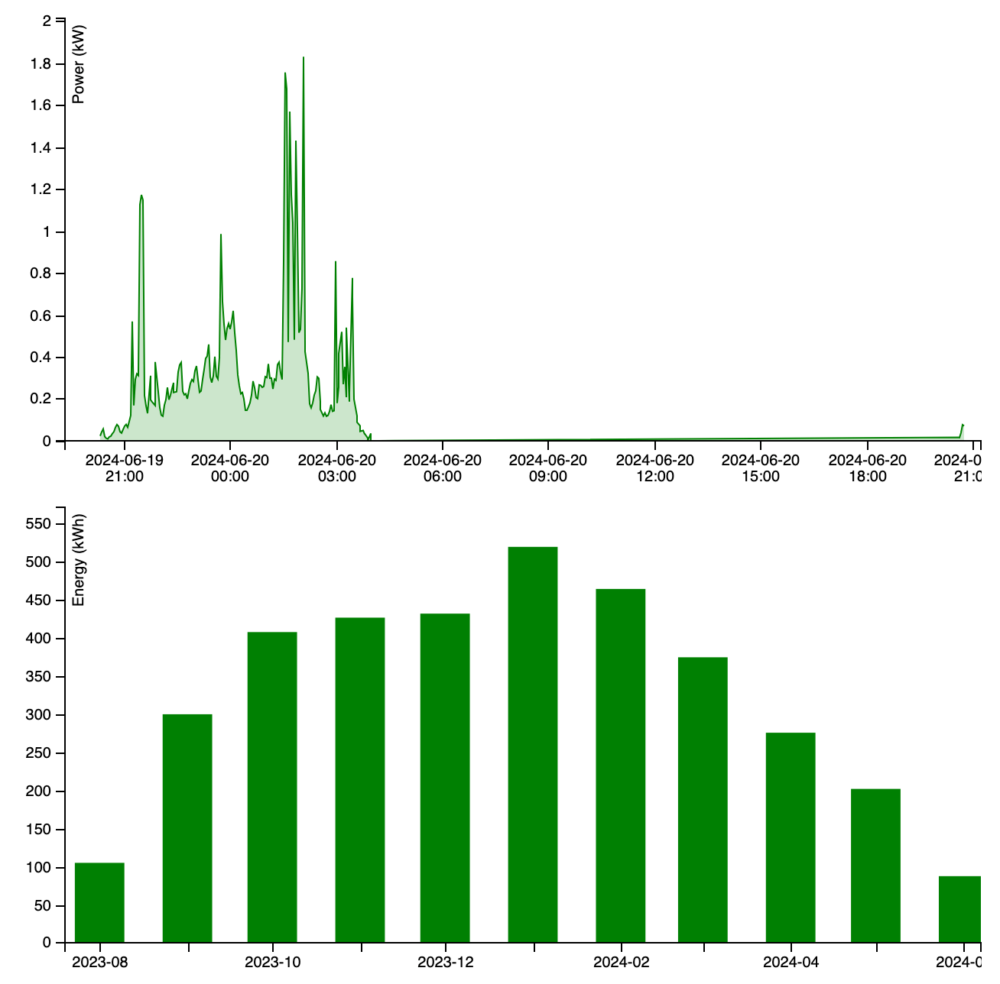
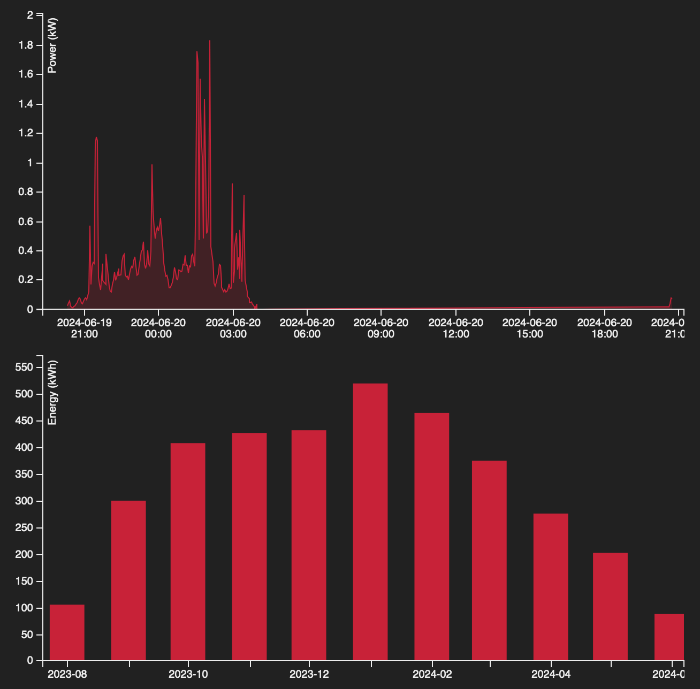

# Energise Ōtaki: Power Overview

This project is a small web app to render of an instantaneous property of a datum stream from SolarNetwork as an "area" style chart
over time, and an accumulating property of the same stream as a "bar" style chart over time.

You can see the chart in action here:

<https://go.solarnetwork.net/nz/eo/power-overview/>



# URL parameters

Various aspects of the charts can be customised via URL query parameters.

> :warning: Remember that the values must be URL escaped. For example a `color` parameter of
> `#FF0000` would be encoded in the URL as `color=%23FF0000`.

| Parameter          | Default               | Description                                                                                                                                      |
| :----------------- | :-------------------- | :----------------------------------------------------------------------------------------------------------------------------------------------- |
| `nodeId`           | 690                   | The SolarNetwork node ID of the datum stream to display.                                                                                         |
| `sourceId`         | `EO/OC/ROOF1/SOLAR/1` | The SolarNetwork source ID of the datum stream to display.                                                                                       |
| `propName`         | `watts`               | The datum stream instantaneous property name to display.                                                                                         |
| `displayName`      | Power (kW)            | The instantaneous property display name, shown in a tooltip when hovering over the active portion of the area chart.                             |
| `accPropName`      | `wattHours`           | The datum stream accumulating property name to display.                                                                                          |
| `accDisplayName`   | Energy (kWh)          | The accumulating property display name, shown in a tooltip when hovering over the active portion of the bar chart.                               |
| `numHours`         | 24                    | The time period to display in the area chart, so the chart displays this many hours ending at the current hour.                                  |
| `numMonths`        | 13                    | The time period to display in the bar chart, so the chart displays this many months ending at the current month.                                 |
| `scale`            | 1000                  | A value to divide raw property values by, to convert to the desired display scale. For example the default scale `1000` converts W values to kW. |
| `width`            | 300                   | The overall width of the chart, in pixels.                                                                                                       |
| `color`            | `#008000`             | The bar color, as a CSS color value.                                                                                                             |
| `backgroundColor`  | `#FFFFFF`             | The page background color, as a CSS color value.                                                                                                 |
| `placeholderColor` | `#EDEDED`             | The bar "placeholder" color, that is the "unused" portion of the donut.                                                                          |
| `textColor`        | `#000000`             | The text label color.                                                                                                                            |

## Color values

The color parameters all accept any value CSS color, such as `#FF0000`, `rgb(255,0,0)`, and so on. For example, a query parameters value like this:

```
color=rgb(200%2C34%2C56)&backgroundColor=%23212121&placeholderColor=%23323232&cornerRadius=0.1&textColor=%23ededed
```

would produce a chart like this:



# Building from source

To build yourself, clone or download this repository. You need to have Node 18+ installed. Then:

```sh
# initialize dependencies
npm ci

# run development live server on http://localhost:8080
npm run dev

# build for production
npm run build
```

Running the `build` script will generate the application into the `dist/` directory.

[billboard]: https://naver.github.io/billboard.js/
